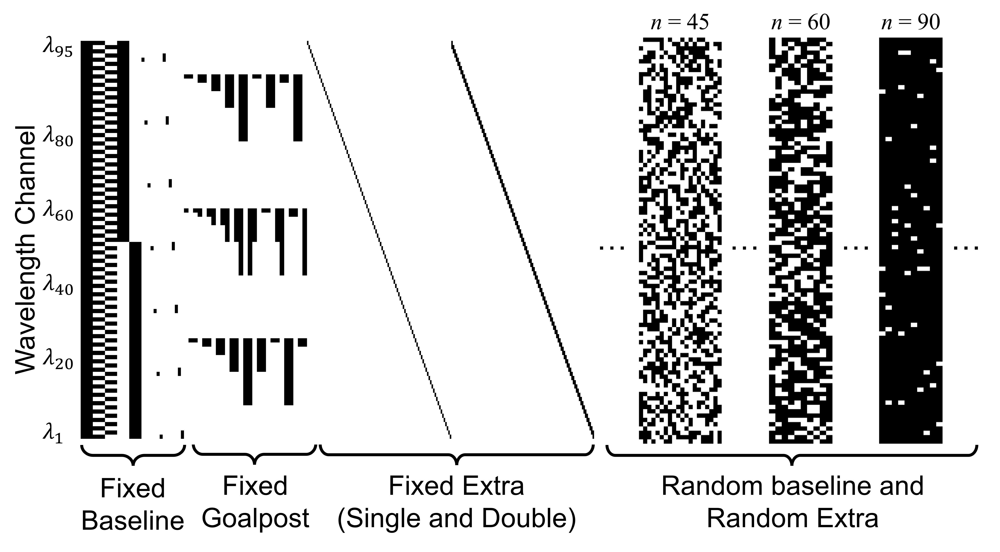

# COSMOS EDFA Dataset

COSMOS _Erbium-Doped Fiber Amplifier_ (_EDFA_) Dataset consists of the gain spectrum measurements using the built-in photodiodes (PDs) and optical channel monitors (OCMs) for 16 EDFAs within 8 commercial grade Lumentum ROADM-20 units deployed in the PAWR COSMOS testbed. The dataset includes measurements collected from 8 booster EDFAs, each with 3 gain settings, and 8 pre-amplifier EDFAs, each with 5 gain settings. For each EDFA at a given gain setting, 3,168 gain spectrum measurements are collected with a set of diverse channel loading configurations and varying input power levels. 

## Terms explanations
- COSMOS: Cloud enhanced Open Software defined MObile wireless testbed for city-Scale deployment, which is the testbed used to collect this optical EDFA dataset.
- Lumentum: A telecommunications equipment company provides commercial optical devices. 
- ROADM: Reconfigurable Optical Add-Drop Multiplexer, which is a form of optical add-drop multiplexer at the wavelength level.
- EDFA: Erbium-Doped Fiber Amplifier, which is most deployed fiber amplifier nowadays.
- WSS: Wavelength Selective Switch, which is important part of ROADM and switches signals between optical fibres on a per-wavelength basis.
- Calient space switch: the 320 $\times$ 320 optical switch used in COSMOS testbed.
- preamp: shortcut of pre-amplifier.
- DUT: Device-Under-Test.
- MUX/DEMUX: Multiplexer / Demultiplexer.
- C-band: wavelength range from 1530 to 1565 nm.
- OCM/PD: Optical Channel Monitor / PhotoDiode.
- JSON: a standard text-based format for representing structured data based on JavaScript object syntax. This format is used for storing the EDFA measurement data.

# Measurement pipeline

The figure shows the block diagram of the block diagram of the Lumentum ROADM-20 unit and the measurement setup of a device under test (DUT) EDFA. Each ROADM unit consists of one MUX wavelength selective switch (WSS), one DEMUX  WSS, one booster EDFA, and one pre-amplifier EDFA, and is equipped with total power and channel power monitoring capabilities using the built-in PDs and OCMs with a power measurement resolution of 0.01 dB and 0.1 dB, respectively.  We use a comb source to generate a set of 95×50 GHz WDM channels in the C-band.

With a DUT booster EDF0A, the output of the comb source is connected to an add port of the MUX WSS, which applies the channel loading configuration, adjusts the power level in each loaded channel, and generates a flat input power spectrum at the DUT EDFA. With a DUT pre-amplifier EDFA, the output of the comb source is first connected to the pre-amplifier EDFA and DEMUX WSS of the auxiliary ROADM, whose DEMUX WSS applies the channel loading configuration, adjusts the power level in each loaded channel, and generates a flat output power spectrum that is transmitted to the input of the DUT pre-amplifier EDFA. The output of the DUT EDFA is terminated.

The wavelength dependent gain spectrum of each EDFA, denoted by $g(\lambda_i)$, can be characterized by its input power spectrum, $S_{\textrm{in}}(\lambda_i)$, and output power spectrum, $S_{\textrm{out}}(\lambda_i)$, i.e., $g(\lambda_i) = S_{\textrm{out}}(\lambda_i)-S_{\textrm{in}}(\lambda_i), \forall i = 1,2,\dots,95$, where $\lambda_1 = 1529.16$ nm (196.050 THz) and $\lambda_{95} = 1566.72$ nm (191.350 THz).

# Channel Loading Configurations

For each EDFA, $g(\lambda_i)$ can vary significantly with different channel loading configurations. However, it is impossible to measure all $2^{95}$ configurations with 95 $\times$ 50 GHz channels where each channel can be switched ON/OFF. To address this challenge, we carefully design 5 sets of diverse channel loading configurations and using four *JSON* files to store the measurement results of the collected data:
* **Fixed Baseline** includes the fully loaded (WDM) channel configuration ($n=95$), 4 half loaded (lower/upper/even/odd) channel configurations ($n \in \{47,48\}$), and 7 selected single/double (adjacent) channel configurations. These channel loading stored in the *fix* dataset folder together with *Fixed Goalpost* mentioned below.
* **Fixed Goalpost** focuses on two sets of consecutive channels located in 3 channel groups (with short/medium/long wavelength), and includes 15 balanced and 12 imbalanced goalpost channel configurations with $n \in \{2,4,8,16,32\}$ and $n \in \{9,18\}$, respectively. These channel loading stored in the *fix* dataset folder together with *Fixed Baseline*.
* **Fixed Extra** includes the complete set of 95 single and 94 double (adjacent) channel loading configurations. These channel loading stored in the *extraLow* dataset folder.
* **Random Baseline** includes 100, 50, 20 random channel loading configurations for each value of $n \in \{1,2,\dots,5\}, \{6,8,\dots,20\}, \{21,24,\dots,48\}$, respectively
*  **Random Extra** expands \emph{Random Baseline} and includes 10 random channel loading configurations for each value of $n \in \{1,2,\dots,94,95\}$


# Dataset Folder Structure

The whole dataset folder structure is shown as following:

```
📦COSMOS-EDFA-Dataset 
 ┣ 📂code  
 ┃ ┣ 📂libs  
 ┃ ┃ ┣ 📜edfaBasicLib.py  
 ┃ ┃ ┣ 📜edfa_feature_extraction_libs.py  
 ┃ ┃ ┣ 📜edfa_examples.py  
 ┃ ┃ ┗ 📜edfa_visual_libs.py  
 ┃ ┗ 📜examples.py  
 ┣ 📂dataset  
 ┃ ┣ 📂booster  
 ┃ ┃ ┣ 📂15dB  
 ┃ ┃ ┃ ┣ 📂extraLow  
 ┃ ┃ ┃ ┃ ┣ 📜edfa_meas_rdm1-co1.xxx.json  
 ┃ ┃ ┃ ┃ ┣ 📜edfa_meas_rdm1-lg1.xxx.json  
 ┃ ┃ ┃ ┃ ┣ 📜edfa_meas_rdm2-co1.xxx.json  
 ┃ ┃ ┃ ┃ ┣ 📜edfa_meas_rdm2-lg1.xxx.json  
 ┃ ┃ ┃ ┃ ┣ 📜edfa_meas_rdm3-co1.xxx.json  
 ┃ ┃ ┃ ┃ ┣ 📜edfa_meas_rdm4-co1.xxx.json  
 ┃ ┃ ┃ ┃ ┣ 📜edfa_meas_rdm5-co1.xxx.json  
 ┃ ┃ ┃ ┃ ┗ 📜edfa_meas_rdm6-co1.xxx.json  
 ┃ ┃ ┃ ┣ 📂extraRandom  
 ┃ ┃ ┃ ┃ ┣ ...
 ┃ ┃ ┃ ┃ ┗ 📜edfa_meas_rdm6-co1.xxx.json  
 ┃ ┃ ┃ ┣ 📂fix  
 ┃ ┃ ┃ ┃ ┣ ...
 ┃ ┃ ┃ ┃ ┗ 📜edfa_meas_rdm6-co1.xxx.json  
 ┃ ┃ ┃ ┗ 📂random  
 ┃ ┃ ┃ ┃ ┣ ...
 ┃ ┃ ┃ ┃ ┗ 📜edfa_meas_rdm6-co1.xxx.json  
 ┃ ┃ ┣ 📂18dB  
 ┃ ┃ ┃ ┣ 📂extraLow  
 ┃ ┃ ┃ ┣ 📂extraRandom  
 ┃ ┃ ┃ ┣ 📂fix  
 ┃ ┃ ┃ ┗ 📂random  
 ┃ ┃ ┗ 📂21dB  
 ┃ ┗ 📂preamp  
 ┃ ┃ ┣ 📂15dB  
 ┃ ┃ ┣ 📂18dB  
 ┃ ┃ ┣ 📂21dB  
 ┃ ┃ ┣ 📂24dB  
 ┃ ┃ ┗ 📂27dB  
 ┣ 📂misc  
 ┃ ┣ 📂measurement_config  
 ┃ ┃ ┣ 📜lumentum_fixed_channel_config.json  
 ┃ ┃ ┗ ...
 ┃ ┣ 📂md_support_materials
 ┃ ┣ 📂ML_features
 ┃ ┗ 📂figures
 ┗ 📜README.md
```
In the `code` folder, we provide examples for users to explore the collected data. 

In the `dataset` folder, all collected EDFA gain measurements in *JSON* format are stored. Specifically, the measurements files are organized by EDFA types (booster or pre-amplifier), gain setting, channel loading conditions, and ROADM names.

In the `misc` folder, we put related all other related files there. For example, channel loading configurations files are located in `measurement_config` folder. `figures` and `ML_features` folder store figures and ML model readable features in *csv* format generated by example codes, respectively. `md_support_materials` folder has all related materials for this document.


## Json File Structure
Each *JSON* file records one set of channel loading conditions with measurement number varies from 550 to 1100. In one *JSON* file, there are `measurement_setup` and `measurement_data`, where  `measurement_setup` structure is same for all files but `measurement_data` are slightly different for booster and pre-amplifier EDFA. We first show the structures of `measurement_setup`, and then go through `measurement_data` the booster *JSON* files and then show the one for pre-amplifier. 
## measurement_setup
```python
"measurement_setup": {
    "date": "2022.03.20.23.33.26",
    "comb_source": "CivilLaser EDFA + Nistica WSS + JSDU EDFA",
    "roadm_model": "Lumentum ROADM-20 Whitebox",
    "roadm_dut": "ROADM1_LG1_BED",
    "roadm_dut_edfa_module": "booster",
    "roadm_wss_channel_attenuation_default": 4.0,
    "roadm_wss_channel_attenuation_deviation": 3.0,
    "roadm_wss_num_channel": 95,
    "roadm_wss_channel_freq_center_start": 191350.0,
    "roadm_wss_channel_spacing": 50.0,
    "roadm_wss_channel_bw": 50.0,
    "roadm_wss_channel_freq_center_list": [
        191350.0,
        191400.0,
        ...
        196050.0
    ]
},
```
In the measurement setup, we record the date, ROADM device name, EDFA type (booster or pre-amplifier). Default attenuation in dB scale is assigned to the WSS before device-under-test (DUT) EDFA. We also record the wavelength channels we used. For example, from the file the first channel frequency is from `191325.0 GHz to 191375.0 GHz`, and the last would from `196025.0 GHz to 196075.0 GHz`. 


## measurement_data

### Booster EDFA
```python
"measurement_data": [
        {
            "open_channel_type": "channel_configuration_name ",
            "attenuation_setting": -2(dBm),
            "repeat_index": 0, # start from 0 for booster
            "calient_input_power_comb_source": float(dBm),
            "calient_input_power_roadm_dut_edfa": float(dBm),
            "roadm_dut_edfa_info": { 
	            "control_mode": "constant-gain",
	            "target_gain": 18.0,
	            "target_gain_tilt": 0.0,
	            "input_power": -0.2, 
	            "output_power": 17.82,
	            ,...,},
            "roadm_dut_line_port_info": {...},
            "roadm_dut_wss_port_info": {...},
            "roadm_dut_wss_num_active_channel": 95,
            "roadm_dut_wss_active_channel_index": 
		        [1,2,...,95],
            "roadm_dut_wss_attenuation": {
	            "1":float(dB),
	            ...,
	            "95":float(dB)},
		    "roadm_dut_wss_input_power_spectra":{
			    "1":float(dBm),
			    ...,
			    "95":float(dBm)},
            "roadm_dut_wss_output_power_spectra": {
			    "1":float(dBm),
			    ...,
			    "95":float(dBm)},
            "roadm_dut_booster_output": {
			    "1":float(dBm),
			    ...,
			    "95":float(dBm)},
        },...,
    ]
```
We put some of the important keys in the diagram:

#### Keys directly related to wavelength gain
- `roadm_dut_wss_num_active_channel`: total number of channels that are opened.
- `roadm_dut_wss_active_channel_index`: a list contains integer number from 1 to 95 which indicates the open channel index. 
- `roadm_dut_wss_attenuation`: a dictionary with keys (wavelength channel index) and values (additional attenuation). E.g., if the additional channel the 2.0 dB for channel 1, the actual attenuation applied on channel 1 is 2.0 dB + default attenuation 4.0 dB.
- `roadm_dut_wss_output_power_spectra`: input spectrum before the DUT booster EDFA. *Note*: power spectrum will include all loaded and unloaded channels.
- `roadm_dut_edfa_info:target_gain`: the gain setting value for DUT EDFA.
- `roadm_dut_booster_output`: output spectrum after the DUT booster EDFA. *Note*: power spectrum will include all loaded and unloaded channels.

#### Other keys in booster *JSON* file
 - `open_channel_type`: name of different [channel loading configuration](#Channel-Loading-Configurations) for different *JSON* fieles.
	- Fix channel loading
		-  `fully_loaded_channel_wdm`: all 95 channels are loaded
		- `half_loaded_channel_odd_index`: all odd index channels are loaded
		- `half_loaded_channel_even_index`: all even index channels are loaded
		- `half_loaded_channel_freq_low`: first 1-48 channels are loaded
		- `half_loaded_channel_freq_high`: channel 49-95 are loaded
		- `single_channel`: each channel from [5, 20, 35, 50, 65, 80, 95] is loaded. 
		- `double_channel`: each adjacent double channel pairs from [(4, 5), (19,20), (34, 35), (49, 50), (64, 65), (79, 80), (94, 95)] are loaded.
		- `goalpost_channel_balanced_freq_low_medium`: take several adjacent channels in low and medium frequency band. The # of the adjacent channels in two bands are equal (balanced). 
		- `goalpost_channel_balanced_freq_low_high`: take several adjacent channels in low and high frequency band. The # of the adjacent channels in two bands are equal (balanced). 
		- `goalpost_channel_balanced_freq_medium_high`: take several adjacent channels in medium and high frequency band. The # of the adjacent channels in two bands are equal (balanced). 
		- `goalpost_channel_unbalanced_freq_low_medium`: take several adjacent channels in low and medium frequency band. The # of the adjacent channels in two bands are *NOT* equal (unbalanced). 
		- `goalpost_channel_unbalanced_freq_low_high`: take several adjacent channels in low and high frequency band. The # of the adjacent channels in two bands are *NOT* equal (unbalanced). 
		- `goalpost_channel_unbalanced_freq_medium_high`: take several adjacent channels in medium and high frequency band. The # of the adjacent channels in two bands are *NOT* equal (unbalanced). 
	- extraLow channel loading
		- `single_channel`: all single channel 
		- `double_channel`: all double adjacent channel pairs
	- random channel loading
		- `random_channel`: random channel # from 1 to 49
	- extraRandom channel loading
		- `random_channel`: random channel # from 1 to 95
- `attenuation_setting`: the additional attenuation applied to all loaded channels before the spectrum flatten function. *Notes*:  spectrum flatten function measure the input spectrum before the DUT EDFA and make the spectrum flat (within 0.1 dB various for most measurements). 
- `repeat_index`: start from 0 for booster. If it is greater than 0, the corresponding measurement repeat the measurement with the exact same setup as previous measurement of `repeat_index` -1.
- `calient_input_power_comb_source`: for internal use. The input power into calient space switch from comb source.
- `calient_input_power_roadm_dut_edfa`: for internal use. The input power into calient space switch from DUT EDFA.
- `roadm_dut_edfa_info`: contains all information related to DUT EDFA. E.g., total input/output power, gain control mode, gain setings, etc.
- `roadm_dut_line_port_info`: record the ROADM line in and line out total power and actual output VOA attenuation.
- `roadm_dut_wss_port_info`: record which WSS port is connected and the total input power into the WSS port.
- `roadm_dut_wss_input_power_spectra`: the input power spectrum  of DUT WSS.

### Preamp EDFA
```python
    "measurement_data": [
        {
            "open_channel_type": "fully_loaded_channel_wdm",
            "attenuation_setting": -2(dBm),
            "repeat_index": 1, # start from 1 for preamp
            "calient_input_power_comb_source": float(dBm),
            "calient_input_power_flatten_roadm_output": float(dBm),
            "roadm_flatten_preamp_info": {...},
            "roadm_flatten_wss_num_active_channel": 95,
            "roadm_flatten_wss_active_channel_index": [...],
            "roadm_flatten_line_port_info":  {...},
            "roadm_flatten_wss_attenuation": {
	            "1":float(dB),
	            ...,
	            "95":float(dB)},
            "roadm_flatten_wss_input_power_spectra":  {...},
            "roadm_flatten_preamp_input_power_spectra":  {...},
            "roadm_dut_preamp_info": { 
	            "control_mode": "constant-gain",
	            "target_gain": 18.0,
	            "target_gain_tilt": 0.0,
	            "input_power": -0.2, 
	            "output_power": 17.82,
	            ,...,},
            "roadm_dut_line_port_info":  {...},
            "roadm_dut_preamp_input_power_spectra": {
			    "1":float(dBm),
			    ...,
			    "95":float(dBm)},
            "roadm_dut_wss_input_power_spectra": {
			    "1":float(dBm),
			    ...,
			    "95":float(dBm)},,...
      ]
```
We put some of the important keys in the diagram:

#### Keys directly related to wavelength gain
- `roadm_flatten_wss_active_channel_index`: a list contains integer number from 1 to 95 which indicates the open channel index. 
- `roadm_flatten_wss_attenuation`: a dictionary with keys (wavelength channel index) and values (additional attenuation). E.g., if the additional channel the 2.0 dB for channel 1, the actual attenuation applied on channel 1 is 2.0 dB + default attenuation 4.0 dB.
- `roadm_dut_preamp_input_power_spectra`: input spectrum before the DUT booster EDFA.
- `roadm_dut_preamp_info:target_gain`: the gain setting value for DUT EDFA.
- `roadm_dut_wss_input_power_spectra`: output spectrum after the DUT booster EDFA.

#### Other keys in preamp *JSON* file

- All the keys in preamp *JSON* file is similar to [booster *JSON* file](#other-keys-in-booster-json-file)


# How to use the dataset

We provide some example python codes to help users to better understand the dataset and plot the EDFA gain spectrum.

## Example codes

### Dependency
`pip install numpy pandas matplotlib scipy pprint`

### Example codes
The example code can be found at `./codes/examples.py` . It supports three different usage of the collected data. 

 1. Plot arbitrary gain spectrum for one json file
-- Function explanation: plot the gain spectrum of any json file
-- How to run the code: `run_examples(option=1)` with parameters selected in the codes.

    
2. Print/plot arbitrary Json data 
-- Function explanation: plot any spectrum collected from any json file.  
-- How to run the code: `run_examples(option=2)` with parameters selected in the codes. Specifically, `subChannelName` can be arbitrary value found from [`open_channel_type`](#other-keys-in-booster-json-file) and `spectrumName` can be arbitrary [*spectrum* element](#measurement_data)

 3. Convert Json raw data to ML readable data file
-- Function explanation: convert selected json files into training/testing/augment dataset in *CSV* format. It consists of the EDFA gain setting, total input/output power, input power spectrum,  channel loading configuration, and the EDFA gain spectrum. 
-- How to run the code: `run_examples(option=3)` with parameters selected in the codes.

### Related Parameters
**edfaTypes**: booster or pre-amplifier EDFA
**gainList**: different gain settings
**channelTypes**: different channel loading conditions for each EDFA
**fileList**: 8 commercial grade Lumentum ROADM-20 units deployed in the PAWR COSMOS testbed

```python
edfaTypes = ["preamp","booster"]
gainLists = ["15dB","18dB","21dB"] # for booster
gainLists = ["15dB","18dB","21dB","24dB","27dB"] # for preamp
channelTypes = ['fix', 'random', 'extraRandom', 'extraLow']
roadmNames = ['rdm1-co1', 'rdm2-co1', 'rdm3-co1', 'rdm4-co1',
			'rdm5-co1', 'rdm6-co1', 'rdm1-lg1', 'rdm2-lg1']
subChannelName # please refer to 'open_channel_type' part
spectrumName # please refer to 'measurement_data' part
```

# Measurement result examples
Fully loaded channel gain plot generated by `example.py` with `option=1` and parameters `edfaType,gain,channelType,roadmName = "booster","18dB","fix","rdm1-co1"`


Randomly loaded channel gain plot generated by `example.py` with `option=1` and parameters `edfaType,gain,channelType,roadmName = "booster","18dB","random","rdm1-co1"`


Single flatten ROADM pre-amplifier input spectrum bar plot generated by `example.py` with `option=2` and parameters `subChannelName,spectrumName = "fully_loaded_channel_wdm","roadm_dut_preamp_input_power_spectra"`


# Related papers
[1] Z. Wang  et al., “An open dataset for EDFA gain spectrum measurements,” https://wiki.cosmos-lab.org/wiki/Datasets (2022).
[2] M. Kohli, T. Chen, J. Welles, M. Baraani Dastjerdi, J. Kolodziejski, M. Sherman, I. Seskar, H. Krishnaswamy, and G. Zussman, “Demo: Remote experimentation with open-access full-duplex wireless in the COSMOS testbed,” in _Proc. ACM MobiCom’20,_ 2020.
[3] T. Chen, J. Yu, A. Minakhmetov, C. Gutterman, M. Sherman, S. Zhu, S. Santaniello, A. Biswas, I. Seskar, G. Zussman, and D. Kilper, “A software-defined programmable testbed for beyond-5G optical-wireless experimentation at city-scale”, _IEEE Network, Special Issue on Next-Generation Optical Access Networks to Support Super-Broadband Services and 5G/6G Mobile Networks,_ vol. 36, no. 2, pp. 90-99, Mar./Apr. 2022.
